# 💰 **Bank Account** 💰
- ***assets*** contient les images utilisées dans cette documentation
- ***backend*** contient 2 types de microservices de l'application Bank Account: ***microservices métiers*** et **microservices utils**
- ***configuration-center*** est un dossier externe contenant les fichiers de configuration des microservices
- ***frontend-app*** est l'application angular à développer
- ***postgresql.yml*** est un template de lancement de la db PostgreSQL dans un container docker

# Description

- **Bank Account** est implémentée en **application orientée microservices** avec des ***microservices métiers*** et des ***microservices utilisataires***
- Les microservices métiers: ***customer***, ***bank-account*** et ***operation***
    - chaque microservice métier est implementé dans une achitecture ***hexagonale***
    - les microcroservices (***customer*** , ***bank-account***) communiquent: c-à-d un **bank-account** a besoin des données d'un **customer** pour être géré
    - les microcroservices (***bank-account*** , ***operation***) communiquent: c-à-d une **operation** a besoin des données d'un **bank-account** pour être géré
    - chaque microservice métier possède ses propres ressources (**db**,**dépendances**, **configurations**, ..), il peut évoluer dans son propre env 
- Les microservices utilitaires: , ***configuration-server***, ***registration-server*** et ***gateway-service***
    - *configuration-server*: pour externaliser et distribuer les configurations aux autres microservices
    - *registration-server*: pour l'enregistrement et le loabalancing des microservices
    - *gateway-service*: pour router dans les deux sens les requêtes entre le front et le back
- Le frontend est une ***application en Angular***

# Architecure


# Conceptual model
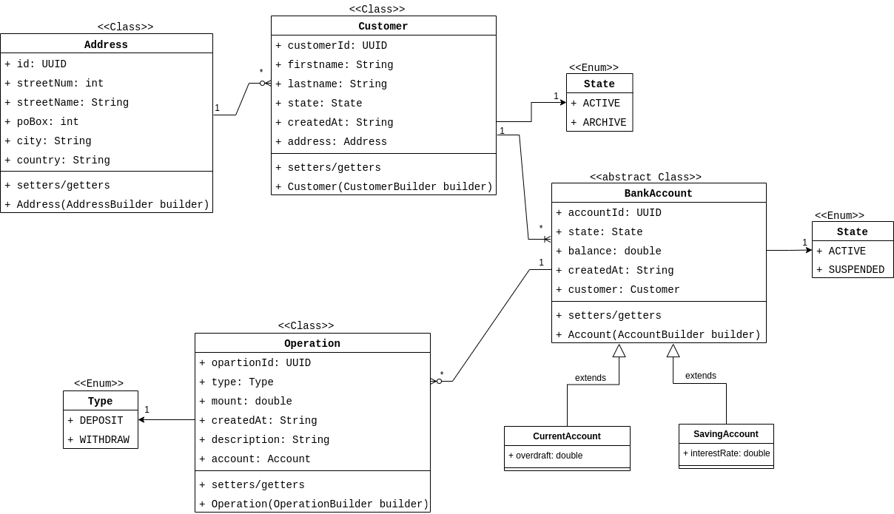

L'application orientée microservice **Bank Account** est dimensionnée comme suit:

# Backend
- 3 business microservices ou microservices métiers
- chaque microservice métier mappe une base données ***PostgreSQL*** déployée dans  un ***docker container***: ```docker compose -f ./postgresql.yml up -d```
- 3 utils microservices ou microservices utilitaires

## Business microservices

- ***business-microservice-customer***
    - *backend/business-micorservices/business-microservice-customer*
- ***business-microservice-bankaccount***
    - *backend/business-micorservices/business-microservice-bankaccount*
- ***business-microservice-operation***
    - *backend/business-micorservices/business-microservice-operation*

## Utils microservices

- ***microservices-config-server***: *backend/utils-microservices/microservices-configuration-server*
    - au démarrage, les microservices demandent leur configurations au serveur **microservices-config-server**
    - le serveur de configuration récupère les config depuis le git repo dans le dossier ***configurations-center*** et les distribuent aux microservices
- ***microservices-registration-server***: *backend/utils-microservices/microservices-registration-server*
    - enregistrement des microservices dans l'annuaire
    - loadbalancer les microservices
    - les services enregistrés dans l'annuaire sont visionnés ici: ```http://localhost:8761```
- ***gateway-service-proxy***: *backend/utils-microservices/gateway-service-proxy*
    - le service gateway route les requêtes http dans les deux sens entre le frontend et la backend
    - voir la configuration ***bootstrap-dev.yml*** du microservice 

## Les api exposeés par les business microservices

Pour accéder au business microservices en backend on passe par la ***gateway-service-proxy*** : ```http://localhost:8101```

### business-microservice-customer

- **[POST]** / **[PUT]**: ```http://localhost:8101/api-customer/customers```: **créer** / **éditer** un customer  
request payload -> 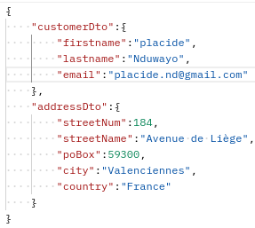    request response ->   
    - si adresse existe déjà (c-à-d un customer est déja enregistré à cette adresse), enregistrer le nouveau customer à cette même adresse
    - si adresse n'existe pas, créer la nouvelle adresse et enregistrer le customer à cette adresse
- **[GET]**: ```http://localhost:8101/api-customer/customers```: **consulter** tous les customers  
- **[GET]**: ```http://localhost:8101/api-customer/addresses```: **consulter** les adresses des customers  

### business-microservice-account

- **[POST]** / **[PUT]**: ```http://localhost:8101/api-bank-account/accounts```: **créer** / **éditer** un bank account  
    - **bank-account api** intérroge le remote **customer api** pour récupérer les infos du customer associé au ***customerId*** fourni par le bank account api  
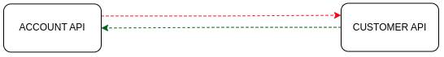  
payload -> 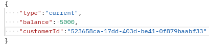 response -> 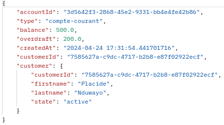   
l'api **bank account** verifie que:
    - le remote ***customer api*** est joignable (reachable/unreachable), sinon une business exception et une forme de relience sont retournées à l'utilisateur
    - le remote ***customer*** associé au ***customerId*** existe, sinon une business exception est renvoyée 
    - le remote customer ***state*** est **active** sinon une business exception est retournées à l'utilisateur  
- **[GET]**: ```http://localhost:8101/api-bank-account/accounts```: **consulter** la liste de tous les comptes 
- **[POST]**: ```http://localhost:8101/api-bank-account/accounts/switch-state```: **suspendre** / **activer** un bank account  
  
payload 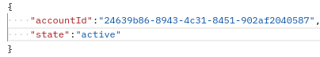 response -> 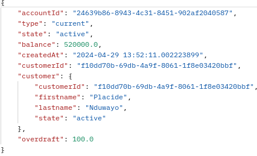  
l'api **bank account** verifie que:
    - le compte existe
    - le compte n'est pas déjà dans le même state que le state fourni
    - le customer api de ce bank account est joignable (reachablea/unreachable) sinon une forme de résilience est renvoyée
    - le customer state est **active**

- **[POST]**: ```http://localhost:8101/api-bank-account/accounts/overdraft```: **update** le découvert d'un bank account  
  
l'api **bank account** verifie que:
    - le compte existe
    - le compte n'est pas suspendu
    - le compte n'est pas un compte epargne
    - le ***customer api*** de ce bank account est joignable (reachablea/unreachable) sinon une forme de résilience est renvoyée
    - le customer ***state*** (active/archive) de bank account est active
- **[GET]**: ```http://localhost:8101/api-bank-account/customers/{customerId}/accounts``` : **consulter** les comptes associés au **customer** et leurs soldes 
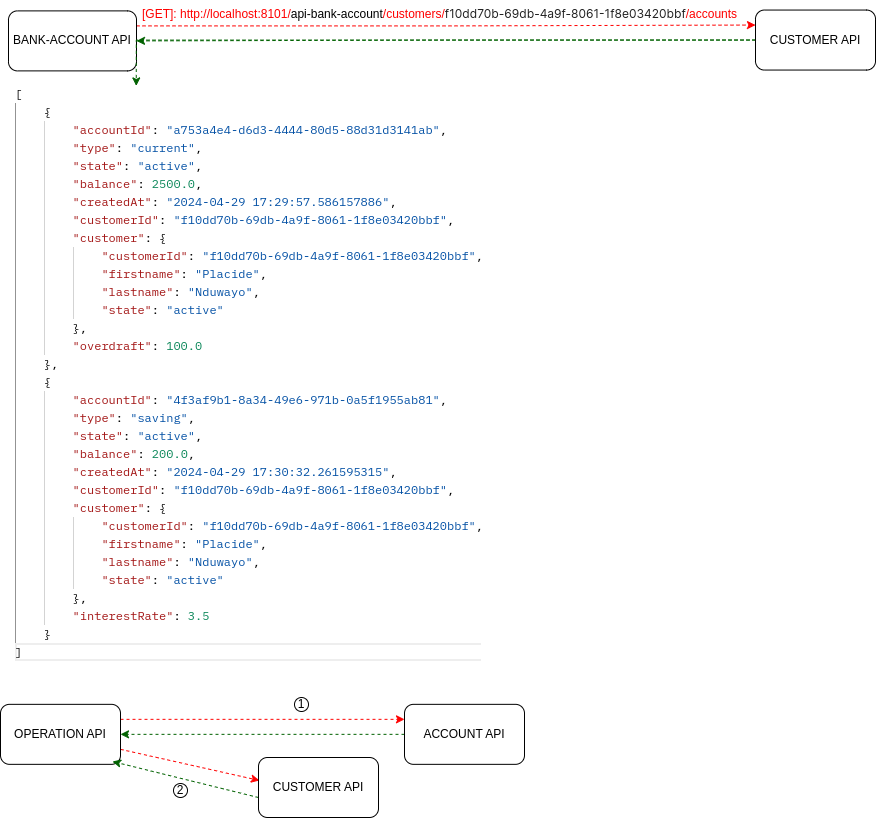  

### business-microservice-operation
- **[POST]**: ```http://localhost:8101/api-operation/operations```: **créer** une opération de **dépot** ou de **retrait**  
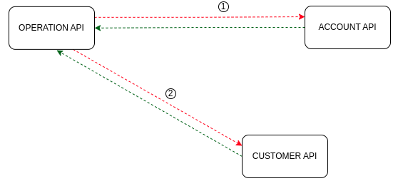  
payload -> 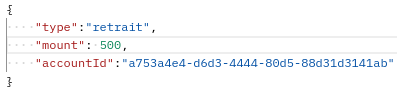   response -> 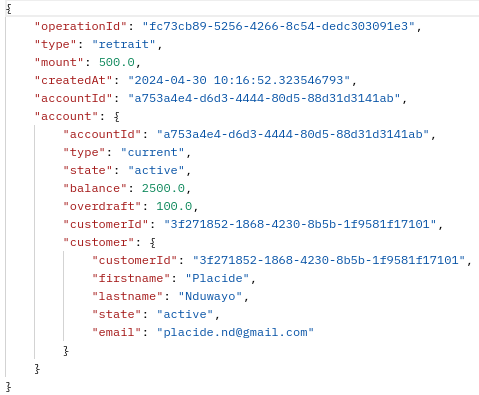  
payload -> 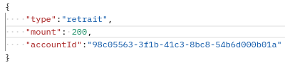   response -> 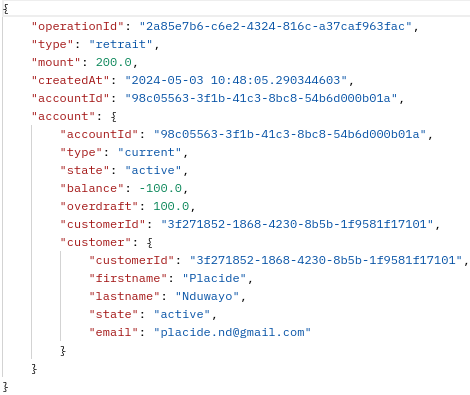  
payload -> 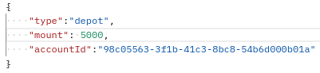   response -> 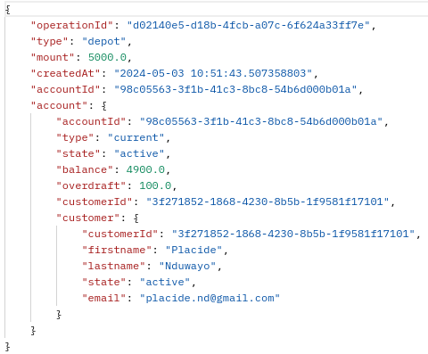  
Pour enregistrer une opération de **dépot** ou de **retrait**, l'**api operation** vérifie que: 
    - le remote api **bank-account** est joignable
    - le remote api **customer** est joignable et que le **state** du customer est **active** 
    - le bank-account est de type **current**
    - si opération est **retrait** vérifier que la balance est suffisante: ```account.balance + account.overdraft >= operation.amount```
        - si OK, l'**api operation** demander à le **remote bank account** de mettre à jour la balance: ```account.balance = account.balance - operation.mount```
    - si opération est de **depot**,l'**api operation** demander à le **remote bank account** de mettre à jour la balance: ```account.balance = account.balance + operation.mount```

- **[GET]**: ```http://localhost:8101/api-operation/accounts/{accountId}/operations```: **consulter** les opérations d'un compte  
l'**api operation** vérifie que:
    - le **remote api bank account** est joignable / l'id du bank account existe
    - le résultat retourné est: la **liste des opérations**, le **compte** et le **customer** associé à ce compte

- **[POST]**: ```http://localhost:8101/api-operation/operations/transfer```: **transfert** entre deux comptes origin est destination
  
payload ->   response ->   
l'**api operation** verifie que:
    - le remote **bank account** api est joignable
    - le remote **bank account origin** est **différent** du remote bank account destination
    - les remotes **bank account origin** et **destination** ne sont pas **suspended**
    - le remote **customer api** est joigable, le **state** des customers n'est pas **archive**
    - la balance du remote **bank account origin** >= mount à transférer: ```origin.getBalance()>= dto.getMount()```
    - si bank accounts origin / destination l'un est *current* et l'autre *saving*:
        - l'**api operation** vérfie que les deux comptes appartiennent au **même customer**: saving bank account accessible par son propriétaire

# La couverture du code source par les tests
**bs-ms-customer** (88%,90%),                       **bs-ms-bank-account** (90%,87%),                         **bs-ms-operation** (94%,83%)  
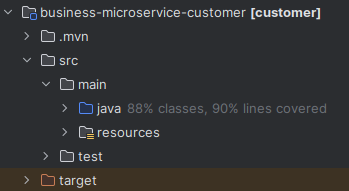 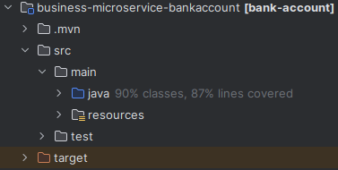 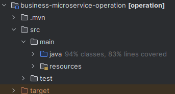 
## business-microservice-operation

# Deploiement en containers docker
- Nous utilisons actuellement l'environnement *dev*: **application-dev.yml**, **bootstrap-dev.yml**
- Après nous déployons tous les microservices de **Bank Account** dans des containers docker
    - Nous allons pour cela utiliser l'environement *integ*: **application-integ.yml**, **bootstrap-integ.yml**
- voir les fichiers de configurations de chaque microservice


# Frontend
Le frontend est une ***application en Angular*** (V16) utilisant le pattern ***observeur de RxJs***
