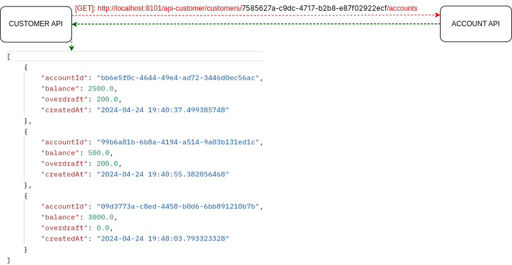
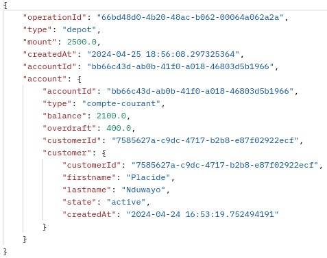

# 💰 **Bank Account** 💰
- ***assets*** contient les images utilisées dans cette documentation
- ***backend*** contient 2 types de microservices de l'application Bank Account: ***microservices métiers*** et **microservices utils**
- ***configuration-center*** est un dossier externe contenant les fichiers de configuration des microservices
- ***frontend-app*** est l'application angular à développer
- ***postgresql.yml*** est un template de lancement de la db PostgreSQL dans un container docker

# Description

- **Bank Account** est implémentée en **application orientée microservices** avec des ***microservices métiers*** et des ***microservices utilisataires***
- Les microservices métiers: ***customer***, ***bank-account*** et ***operation***
    - chaque microservice métier est implementé dans une achitecture ***hexagonale***
    - les microcroservices (***customer*** , ***bank-account***) communiquent: c-à-d un **bank-account** a besoin des données d'un **customer** pour être géré
    - les microcroservices (***bank-account*** , ***operation***) communiquent: c-à-d une **operation** a besoin des données d'un **bank-account** pour être géré
    - chaque microservice métier possède ses propres ressources (**db**,**dépendances**, **configurations**, ..), il peut évoluer dans son propre env 
- Les microservices utilitaires: , ***configuration-server***, ***registration-server*** et ***gateway-service***
    - *configuration-server*: pour externaliser et distribuer les configurations aux autres microservices
    - *registration-server*: pour l'enregistrement et le loabalancing des microservices
    - *gateway-service*: pour router dans les deux sens les requêtes entre le front et le back
- Le frontend est une ***application en Angular***

# Architecure


# Conceptual model


L'application orientée microservice **Bank Account** est dimensionnée comme suit:

# Backend
- 3 business microservices ou microservices métiers
- chaque microservice métier mappe une base données ***PostgreSQL*** déployée dans  un ***docker container***: ```docker compose -f ./postgresql.yml up -d```
- 3 utils microservices ou microservices utilitaires

## Business microservices

- ***business-microservice-customer***
    - *backend/business-micorservices/business-microservice-customer*
- ***business-microservice-bank-account***
    - *backend/business-micorservices/business-microservice-bank-account*
- ***business-microservice-operation***
    - *backend/business-micorservices/business-microservice-operation*

## Utils microservices

- ***microservices-config-server***: *backend/utils-microservices/microservices-configuration-server*
    - au démarrage, les microservices demandent leur configurations au serveur **microservices-config-server**
    - le serveur de configuration récupère les config depuis le git repo dans le dossier ***configurations-center*** et les distribuent aux microservices
- ***microservices-registration-server***: *backend/utils-microservices/microservices-registration-server*
    - enregistrement des microservices dans l'annuaire
    - loadbalancer les microservices
    - les services enregistrés dans l'annuaire sont visionnés ici: ```http://localhost:8761```
- ***gateway-service-proxy***: *backend/utils-microservices/gateway-service-proxy*
    - le service gateway route les requêtes http dans les deux sens entre le frontend et la backend
    - voir la configuration ***bootstrap-dev.yml*** du microservice 

## Les api exposeés par les business microservices

Pour accéder au business microservices en backend on passe par la ***gateway-service-proxy*** : ```http://localhost:8101```

### business-microservice-customer

- **[POST]** / **[PUT]**: ```http://localhost:8101/api-customer/customers```  pour créer / éditer un customer  
request payload ->     response ->   
- **[GET]**: ```http://localhost:8101/api-customer/customers```  pour consulter tous les customers  
- **[GET]**: ```http://localhost:8101/api-customer/addresses``` pour consulter les adresses des customers  
- **[GET]**: ```http://localhost:8101/api-customer/customers/{customerId}/accounts``` : pour consulter les comptes et leurs soldes du ***customer*** depuis le remote ***bank-account***    

- si le ***customerId*** fourni n'existe pas ou si le ***customer api*** est down une business exception et une forme relience sont retournées à l'utilisateur

### business-microservice-account

Pour créer / editer un compte, **bank-account api** intérroge **customer api** pour récupérer les infos du customer associé au ***customerId*** fourni par le account
- **[POST]** / **[PUT]**: ```http://localhost:8101/api-bank-account/accounts```  
  
   request payload ->     response -> 
- si le ***customerId*** fourni n'existe pas ou si le ***customer api*** est down une business exception et une forme de relience sont retournées à l'utilisateur
- si le state du customer est **archive**, une business exception est retournées à l'utilisateur
- **[GET]**: ```http://localhost:8101/api-bank-account/accounts```: consulter la liste de tous les comptes

### business-microservice-operation
- **[POST]**: ```http://localhost:8101/api-operation/operations```: pour créer une opération de **dépot** ou de **retrait**  
request payload ->    response -> 
 
- Pour enregistrer une opération:
    - **(1)** l'api **operation** requête à la remote api **bank-account** pour récupérer les informations du compté associé à **accountId**
        - **(1.1)** l'api **operation** vérifie que l'api **bank-account** est joignable, si ok passe à **(1.2)**
        - **(1.2)** l'api **operation** vérifie que c'est un bank-account **courant** (seuls les bank-account courants autorisent les transactions), si oui passer à **(1.3)**
        - **(1.3)** si opération de **retrait**, l'api operation vérifie la **balance** du compte ```account.balance + account.overdraft >= operation.amount```, si OK, passer à **(2)**
    - **(2)** l'api **operation** requête la remote api **customer** moyenant le **customerId** de account reçu à **(1)** (un bank-account est associé à un customer)
        - **(2.1)** l'api operation vérifie que customer est joignable, si OK, passer à **(2.2)**
        - **(2.2)** si le **state** du customer est **active** l'opération est sauvegardée en db sinon (customer state **archive**) une **business exception** est renvoyée

# Deploiement en containers docker
- Nous utilisons actuellement l'environnement *dev*: **application-dev.yml**, **bootstrap-dev.yml**
- Après nous déployons tous les microservices de **Bank Account** dans des containers docker
    - Nous allons pour cela utiliser l'environement *integ*: **application-integ.yml**, **bootstrap-integ.yml**
- voir les fichiers de configurations de chaque microservice


# Frontend
Le frontend est une ***application en Angular*** (V16) utilisant le pattern ***observeur de RxJs***
