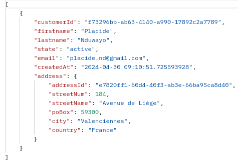

# 💰 **Bank Account** 💰

## Description

- **Bank Account** est une **application orientée microservices** avec des ***microservices métiers*** et des ***microservices utilisataires***
- Les microservices métiers: ***customer***, ***account*** et ***operation***
    - chaque microservice métier est implementé dans une ***achitecture hexagonale***
    - les microcroservices (***customer*** , ***account***) communiquent: c-à-d un **account** a besoin des données d'un **customer** pour être géré
    - les microcroservices (***account*** , ***operation***) communiquent: c-à-d une **operation** a besoin des données d'un **account** pour être géré
    - chaque microservice métier possède ses propres ressources (**db**,**dépendances**, **configurations**, ..), il peut évoluer dans son propre env 
- Les microservices utilitaires: , ***configuration-server***, ***registration-server*** et ***gateway-service***
    - *configuration-server*: pour externaliser et distribuer les configurations aux autres microservices
    - *registration-server*: pour l'enregistrement et le loabalancing des microservices
    - *gateway-service*: pour router dans les deux sens les requêtes entre le front et le back
- Le frontend est une ***application en Angular***

## Architecure


## Conceptual model


L'application orientée microservice **Bank Account** est dimensionnée comme suit:

## Backend
- 3 microservices métiers (business microservices)
- chaque microservice métier mappe une base données ***PostgreSQL*** déployée dans  un ***docker container***
    - le fichier ***postgresql.yml*** sert de lancer le container docker de PostgreSQL: ```docker compose -f ./postgresql.yml up -d```
- 3 microservices utilitaires (utils microservices)

### Microservices métiers

- ***business-microservice-customer***
    - *backend/business-micorservices/business-microservice-customer*
- ***business-microservice-account***
    - *backend/business-micorservices/business-microservice-account*
- ***business-microservice-operation***
    - *backend/business-micorservices/business-microservice-operation*

### Microservices utilitaires

- ***microservices-config-server***: *backend/utils-microservices/microservices-configuration-server*
    - au démarrage, les microservices demandent leur configurations au serveur **microservices-config-server**
    - le serveur de configuration récupère les config depuis le git repo dans le dossier ***configurations-center*** et les distribuent aux microservices
- ***microservices-registration-server***: *backend/utils-microservices/microservices-registration-server*
    - enregistrement des microservices dans l'annuaire
    - loadbalancer les microservices
    - les services enregistrés dans l'annuaire sont visionnés ici: ```http://localhost:8761```
- ***gateway-service-proxy***: *backend/utils-microservices/gateway-service-proxy*
    - le service gateway route les requêtes http dans les deux sens entre le frontend et la backend
    - voir la configuration ***bootstrap-dev.yml*** du microservice 

### Les api exposeés par les microservices métiers
Pour accéder au microservices métiers backend on passe par la gateway : ```http://localhost:8101```
- ***business-microservice-customer***
    - [POST], [PUT]: ```http://localhost:8101/api-customer/customers```  
    request dto payload:  
    [customer-post](./assets/customer-post.png)    request response: 
    - [GET] : ```http://localhost:8101/api-customer/customers```  
    - [GET] : ```http://localhost:8101/api-customer/addresses```

- ***business-microservice-account***
   - [POST], [PUT]: ```http://localhost:8101/api-account/accounts```  
        dto payload:
        ```{
                "type": "compte-courant ou compte-epargne",
                "balance": int value,
                "overdraft": int value,
                "customerId":"id of remote customer"
        }
        ```

## Deploiement en containers docker
- Nous utilisons actuellement l'environnement *dev*: **application-dev.yml**, **bootstrap-dev.yml**
- Après nous déployons tous les microservices de **Bank Account** dans des containers docker
    - Nous allons pour cela utiliser l'environement *integ*: **application-integ.yml**, **bootstrap-integ.yml**
- voir les fichiers de configurations de chaque microservice


## Frontend
Le frontend est une ***application en Angular*** (V16) utilisant le pattern ***observeur de RxJs***
